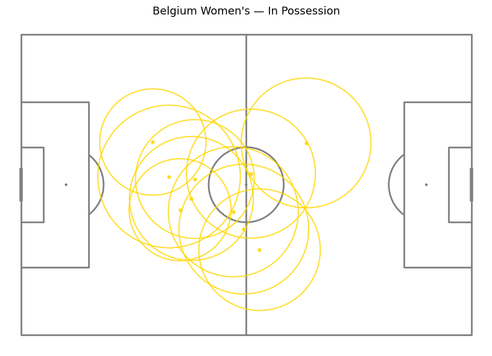
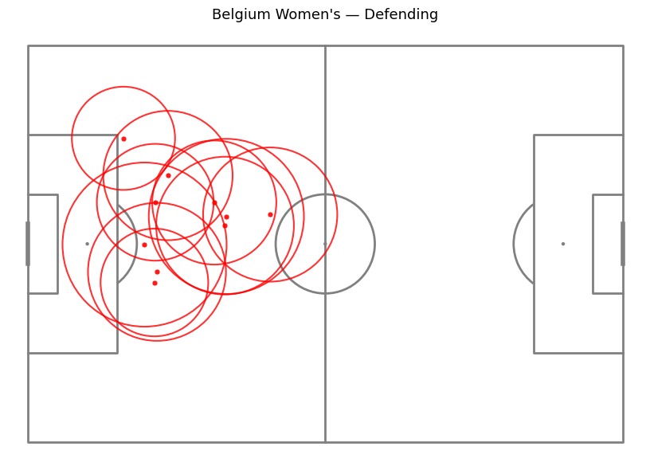
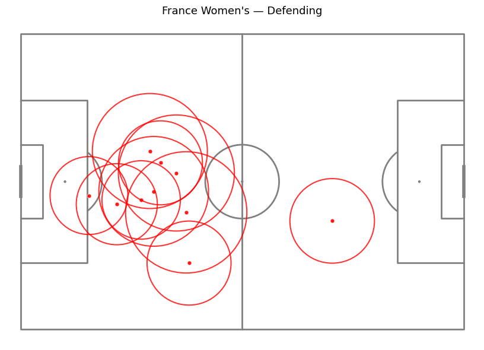
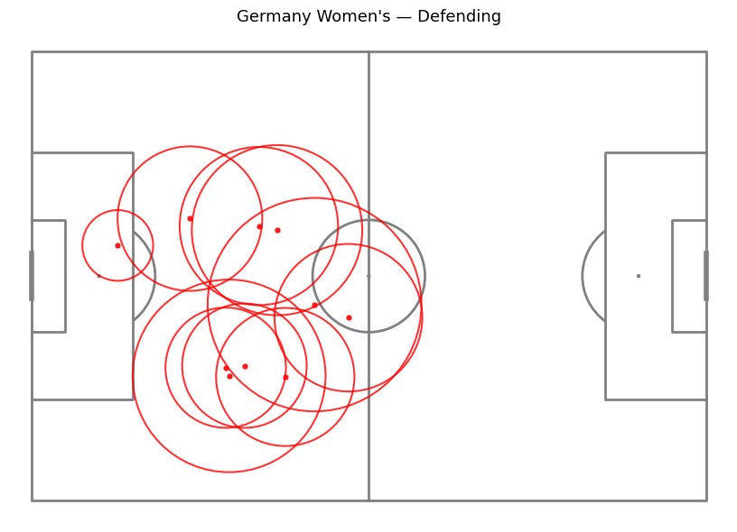
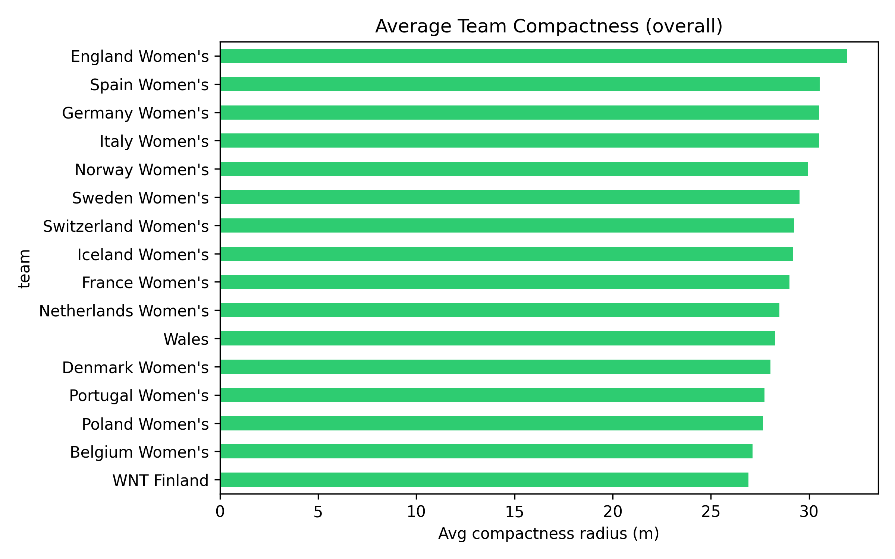
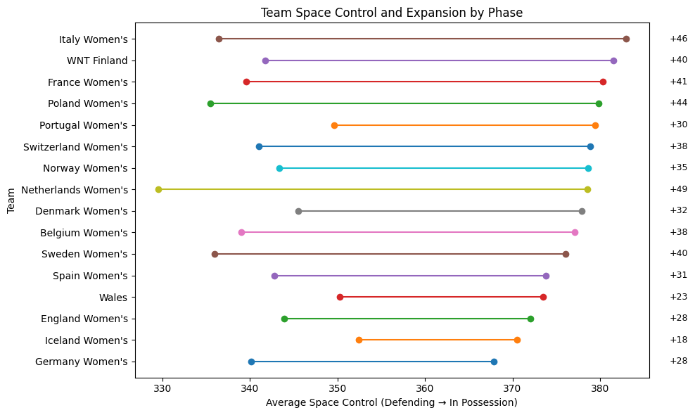

# Spatial Structure and Tactical Style in the UEFA Women’s Euro 2025

This project analyzes team spacing, compactness, and space control in the UEFA Women’s Euro 2025 using event-level StatsBomb data. Instead of relying on traditional box-score stats (passes, shots, goals), this analysis focuses on how teams organize themselves spatially across different phases of play.

The goal is to understand how teams play — not just how often they score or win.

---

## Key Questions

- How does team compactness change between defending and attacking phases?
- Do teams differ meaningfully in how they expand or contract their shape?
- What tactical information is captured by spatial structure that box-score metrics miss?

---

## Key Findings

- Teams consistently adopt tighter spatial structures when defending and expand modestly
  when in possession.
- Differences in compactness are driven more by phase of play than by fixed team identity.
- Teams vary in how aggressively they expand in possession, reflecting stylistic and tactical
  choices rather than a single dominant approach.
- Compactness and space control describe **how teams play** more reliably than **how often
  they win**, showing weak direct relationships with match outcomes.

---

## Why This Matters

Spatial metrics provide structural context that complements traditional performance statistics.
Analyses like this can support tactical profiling, opponent scouting, and style-based team
comparison by quantifying how teams organize themselves beyond on-ball events.

---

## Visual Highlights

### ⚽ Team Spatial Structure by Phase (In Possession vs Defending)
Pitch-level visualizations showing how teams **expand in possession** and **contract defensively**, using player centroids and compactness radii to represent team shape.

---

#### 🇧🇪 Belgium Women’s

| In Possession | Defending |
|-------------|-----------|
|  |  |

---

#### 🇩🇪 Germany Women’s

| In Possession | Defending |
|-------------|-----------|
|  |  |

---

### 📏 Team Compactness Across the Tournament
Comparison of **average team compactness** across all teams, highlighting overall differences in spatial organization.

---

### 🔁 Compactness by Phase of Play
Teams are consistently **more compact when defending** and **expand in possession**, regardless of team identity.

---

### 🧭 Space Control & Tactical Expansion by Team
Comparing how much **space teams control** between defending and attacking phases, revealing stylistic differences rather than performance outcomes.

---

## Project Contents

- `notebooks/data_load.ipynb` – Main analysis notebook with visualizations and interpretations
- `src/` – Helper functions for data loading, compactness calculation, and visualization
- `visuals/` – Generated figures used in the analysis

---

## Tools Used

- Python (pandas, numpy, matplotlib)
- statsbombpy
- mplsoccer

